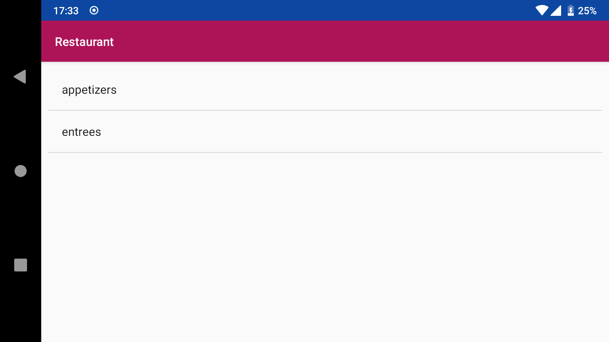
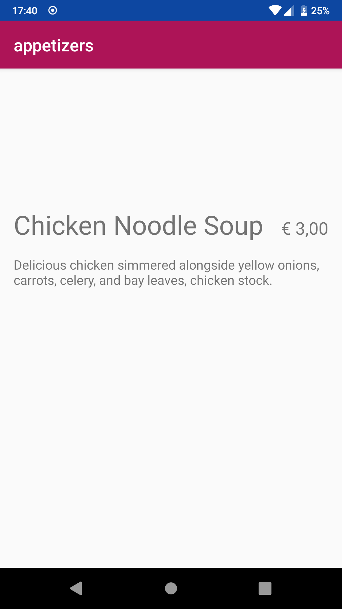

# Restaurant

This app lets the user browse a restaurant's menu. It connects to the restaurant's API to requests the menu's categories and items.

## Activities

### Categories

The user can browse through the categories.

### Menu items

Once the user chooses a category, they end up in this screen, where they can browse through the menu items. 

Names and descriptions are ellipsized, so the user must click on an item to view the full description (and name, if it would be too long).

The price is formatted according to the device's settings.

Missing images do not affect the general layout.

### Detailed menu items

Clicking a menu item brings the user to this screen, where they can view the menu item in full.

Missing images do not affect the general layout.

